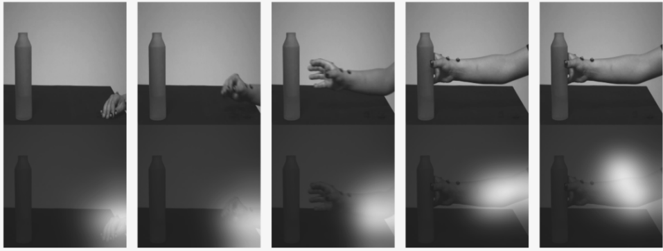

# Video Gesture Analysis for Autism Spectrum Disorder Detection

## Reference
Code for the paper **Video Gesture Analysis for Autism Spectrum Disorder Detection**, Zunino et al, ICPR 2018 ([pdf](https://www.researchgate.net/publication/327751352_Video_Gesture_Analysis_for_Autism_Spectrum_Disorder_Detection), [proceedings](https://ieeexplore.ieee.org/xpl/mostRecentIssue.jsp?punumber=8527858))

```
@inproceedings{2018_ICPR,
author = {Andrea Zunino and Pietro Morerio and Andrea Cavallo and Caterina Ansuini and Jessica Podda and Francesca Battaglia and Edvige Veneselli and Cristina Becchio and Vittorio Murino},
title = {Video Gesture Analysis for Autism Spectrum Disorder Detection},
booktitle = {International Conference on Pattern Recognition (ICPR)},
year = {2018},
}
```

## The dataset
The [dataset](https://pavis.iit.it/index.php/datasets/autism-spectrum-disorder-detection-dataset) contains trials performed by both autistic kids and control subjects. Main task is to perform this two-class classification.




## The code 
This repo is based on [this public code](https://github.com/kracwarlock/action-recognition-visual-attention) implementing an [attention-based LSTM](https://arxiv.org/abs/1511.04119v3) and is meant to classify autistic kids from the kinematics of motion. It contains:
- matlab scripts for estracting CNN features from the video frames (GoogleNet - Caffe) 
- python scripts for the actual LSTM training (theano)

### (Main) Dependencies
* Python 2.7
* [NumPy](http://www.numpy.org/)
* [scikit learn](http://scikit-learn.org/stable/index.html)
* [skimage](http://scikit-image.org/docs/dev/api/skimage.html)
* [Theano](http://www.deeplearning.net/software/theano/)
* [h5py](http://docs.h5py.org/en/latest/)
* Matlab
* [Caffe](https://github.com/BVLC/caffe)


## License
This repository is released under the MIT LICENSE.
